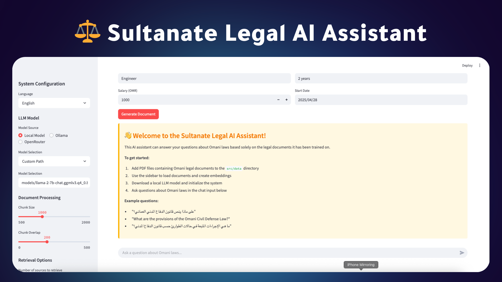

# ShariaAI - Omani Legal Assistant



ShariaAI is an intelligent legal assistant that helps users navigate Omani laws through natural language interactions. The system provides document search, summarization, comparison, and generation capabilities while strictly adhering to official legal texts.

## Features

- **Legal Document Search**: Upload and parse Omani legal PDFs with semantic search and highlighted excerpts
- **Integrated Voice Input**: Direct speech-to-text conversion in the chat interface for natural interactions
- **Section Navigator**: Browse laws, articles, and clauses hierarchically with automatic summarization
- **Provision Comparison**: Advanced AI-powered comparison of legal provisions with highlighted differences
- **Case Analysis**: Assess legal impact of scenarios with multi-document citation reports
- **Document Drafter**: Generate template-based legal documents with custom PDF styling

## Key Improvements

### Enhanced Voice Query Feature
- **Simplified User Experience**: Streamlined voice recording directly in the chat interface
- **Direct Audio-to-Text**: Using PyAudio for direct recording and Whisper for accurate Arabic transcription
- **Preview Before Sending**: See transcribed text before submitting to verify accuracy

### Improved Provision Comparison
- **Arabic Text Handling**: Enhanced algorithms specifically tuned for Arabic legal terminology
- **Context-Aware Comparison**: AI-powered processing to understand legal context beyond simple text matching
- **Visual Highlighting**: Clear visual indicators for additions, modifications, and removals between provisions

### Document Processing
- **Increased Document Loading**: Now loads up to 30 legal documents for comprehensive coverage
- **Prioritized Criminal Law**: Special focus on criminal law documents for specialized legal assistance

## Design Decisions

### Why Streamlit?
We chose Streamlit for its rapid prototyping capabilities and ease of deployment for legal professionals without requiring extensive frontend knowledge. The framework enables quick iteration while maintaining a professional UI.

### Why Direct Audio Recording?
The simplified audio recording approach using PyAudio provides a more reliable experience than WebRTC, especially for Arabic speech recognition. It eliminates echo problems and offers a clearer workflow.

### Why AI-powered Legal Comparison?
Legal provisions, especially in Arabic, require sophisticated understanding beyond keyword matching. Our AI approach enables semantic understanding of legal concepts even when terminology differs.

## Tech Stack

- **Frontend**: Streamlit with custom CSS for a clean legal interface
- **Document Processing**: PyMuPDF + LangChain for extracting and processing legal texts
- **Vector Database**: ChromaDB for efficient semantic search capabilities
- **LLM Integration**: OpenRouter API with the Qwen model for enhanced Arabic processing
- **Audio Processing**: PyAudio + Whisper for accurate voice transcription
- **Voice Recognition**: Streamlined voice input for Arabic legal queries

## Installation

1. Clone the repository:
   ```bash
   git clone https://github.com/alanqoudif/ankaa-project.git
   cd ankaa-project
   ```

2. Create a virtual environment and install dependencies:
   ```bash
   python -m venv venv
   source venv/bin/activate  # On Windows: venv\Scripts\activate
   pip install -r requirements.txt
   ```

3. Run the application:
   ```bash
   streamlit run app.py
   ```

## Project Structure

```
ShariaAI/
├── app.py                 # Main Streamlit application with integrated voice chat
├── requirements.txt       # Python dependencies
├── README.md              # Documentation
├── Dockerfile             # Container configuration for deployment
├── pho.png                # Project logo image
├── static/                # Static assets
│   └── style.css          # Custom styling for the application
│
├── data/                  # Legal document repository
│   └── Law*.pdf           # Omani legal documents in PDF format
│
├── generated_docs/        # Output directory for generated legal documents
│   └── *.pdf              # Generated legal documents and case analyses
│
├── omani_laws/            # Vector database for legal document embeddings
│   └── chroma.sqlite3     # ChromaDB storage for semantic search
│
├── utils/                 # Application modules
    ├── audio_processor.py     # Voice recording and transcription with PyAudio
    ├── case_analyzer.py       # Legal case analysis capabilities
    ├── document_drafter.py    # Document generation and templating
    ├── document_processor.py  # PDF parsing and text extraction
    ├── env_loader.py          # Environment variable configuration
    ├── legal_comparison.py    # AI-powered provision comparison
    ├── pdf_generator.py       # PDF creation and styling
    ├── qa_chain.py            # Question-answering chain with LLM
    ├── section_navigator.py   # Hierarchical document navigation
    ├── supabase_client.py     # Authentication and storage (optional)
    └── translation_service.py # Arabic-English translation capabilities
```

## API Keys

The application uses the following API keys:
- OpenRouter API for LLM access
- LlamaIndex API for local LLM fallback (optional)
- Supabase for authentication (optional)

To set up your own API keys, modify the relevant constants in the utility modules.

## Development

The project follows a level-based development approach:

1. **Level 1**: Document ingestion and basic Q&A
2. **Level 2**: Section navigation and summarization
3. **Level 3**: Voice-activated comparison
4. **Level 4**: Document generation capabilities
5. **Level 5**: Case analysis and risk assessment

## Contributing

Contributions are welcome! Please feel free to submit a Pull Request.

## License

This project is licensed under the MIT License.

## Contact

For any questions or issues, please open an issue on the GitHub repository.
